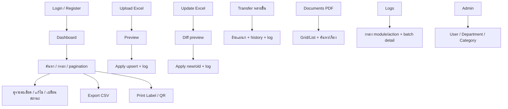
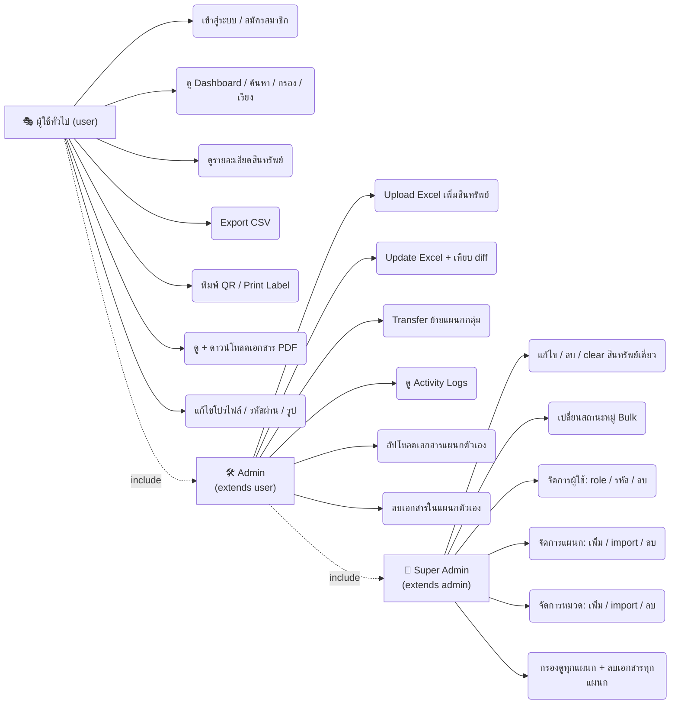

# เอกสารอธิบายระบบ Asset Management

> เอกสารฉบับละเอียด อธิบายระบบทั้งหมดแบบทีละขั้นตอน แบ่งเป็น **Backend** และ **Frontend** อย่างชัดเจน

---

## ภาพรวมสถาปัตยกรรม

| ชั้น | เทคโนโลยี |
|---|---|
| เซิร์ฟเวอร์ | Node.js + Express 5.2.1 |
| Template | EJS (Server-Side Rendering) |
| ฐานข้อมูล | MySQL (ผ่าน `mysql2`) |
| Session | `express-session` + `express-mysql-session` (เก็บใน DB) |
| รหัสผ่าน | `bcrypt` |
| อัปโหลดไฟล์ | `multer` (.xlsx/.xls/.csv, .pdf, รูปโปรไฟล์) |
| อ่าน Excel | `xlsx` |
| อีเมล | `nodemailer` (SMTP) |
| ความปลอดภัย | `helmet` (headers + CSP), custom CSRF, custom rate-limit, reCAPTCHA |

### โครงสร้างโฟลเดอร์

```text
app.js                  <- ทางเข้าหลักของเซิร์ฟเวอร์
config/db.js            <- สร้าง/เชื่อมต่อ MySQL + กำหนด schema
middleware/             <- auth.js, csrf.js, locale.js, upload.js, rateLimit...
routes/                 <- auth, dashboard, upload, update, transfer, documents, logs, profile, admin
controllers/            <- ตัวจัดการ logic ของแต่ละ route
models/                 <- คำสั่ง SQL ของแต่ละตาราง
helpers/excelParser.js  <- แปลง Excel -> rows
views/                  <- ไฟล์ EJS (หน้าจอ + partials)
public/                 <- css/js ของฝั่ง client
locales/                <- th.json, en.json (i18n)
```

### ภาพรวม request cycle

```text
Browser ──GET/POST──▶ Express (app.js)
                        │ 1. middleware chain (helmet, body, session, logger, locals)
                        │ 2. route + controller
                        ▼
                     MySQL (models) ◀── SQL ──▶ ข้อมูล
                        │
                    response (EJS render หรือ redirect/flash)
                        ▼
                     Browser แสดงผล (Bootstrap + custom JS)
```

---

# PART 1 — BACKEND

## 1. จุดเริ่มต้น: `app.js`

ลำดับ middleware (chain) เมื่อเซิร์ฟเวอร์ start:

1. **helmet** — ตั้ง security headers รวมถึง **CSP** (Content-Security-Policy) ที่อนุญาตเฉพาะ CDN ของ Bootstrap / bootstrap-icons / SweetAlert2 เท่านั้น (จึงโหลดผ่าน jsdelivr)
2. **express.json() / express.urlencoded()** — parse body ของ request (JSON + form)
3. **express-session + express-mysql-session** — session ของผู้ใช้เก็บในตาราง MySQL (ไม่ใช่หน่วยความจำ)
4. **Request logger** — บันทึกทุก request (method, url, status, duration, IP)
5. **res.locals helper** — inject `flash` (error/success), `csrfToken`, `RECAPTCHA_SITE_KEY` ไปให้ทุก view
6. **Static files** — เปิด service โฟลเดอร์ `public/`
7. **Route mounting** — ต่อ middleware ตรวจ login/role แล้ว mount:
   - `/auth/*` → authController
   - `/` → dashboardController
   - `/upload`, `/update`, `/transfer`, `/documents`, `/logs`, `/profile`, `/admin`
8. **Error handler** — 404 + error 500

```js
// app.js (แนวคิด)
app.use(helmet(...));
app.use(express.json());
app.use(express.urlencoded({ extended: true }));
app.use(session({ store: new MySQLStore(...), ... }));
app.use(requestLogger);
app.use((req, res, next) => { res.locals.csrfToken = ...; next(); });
app.use(express.static('public'));
app.use('/auth', require('./routes/auth'));
app.use('/', require('./routes/dashboard'));
// ...
```

## 2. `config/db.js` — เชื่อมต่อและสร้างฐานข้อมูล

- สร้าง **connection pool** (ค่าจาก `.env`)
- ฟังก์ชัน `createDatabase()` — รันตอน start ครั้งแรก:
  - สร้าง database `asset_management` ถ้ายังไม่มี
  - สร้างตารางหลัก: **users, assets, departments, categories**
  - ตารางสนับสนุน: **activity_logs, transfer_history, documents**
  - **migrations** — ตรวจจับว่าคอลัมน์ใหม่ (เช่น `EXPIRE_DATE`) มีอยู่ไหม ถ้าไม่มี `ALTER TABLE` เพิ่มให้
- ผู้ใช้ DB หลัก: `asset`@localhost

### ตารางหลัก

| ตาราง | หน้าที่ / คอลัมน์ที่สำคัญ |
|---|---|
| `users` | username, email, password_hash, role (`user`/`admin`/`super_admin`), department, full_name, verified |
| `assets` | ~20 คอลัมน์: BUSINESS_UNIT, ASSET_ID, TAG_NUMBER, SERIAL_NUMBER_ASSET, DESCR, MODEL, PLANT, DEPTID, DEPT_NAME, CATEGORY, ASSET_STATUS, X_AGREEMENT_ID, EXPIRE_DATE, owner, updated_by, qr_code... |
| `departments` | costcenter, name |
| `categories` | code, name |
| `activity_logs` | module, action, target, details (บันทึกแบบ batch) |
| `transfer_history` | asset_id, from_dept, to_dept, transferred_by, note |
| `documents` | ไฟล์ PDF + department + uploader |

## 3. Middleware (ทีละตัว)

### `auth.js` — ตรวจสิทธิ์ (gate)

| ตัว | เงื่อนไข |
|---|---|
| `requireAuth` | ต้อง login ไม่งั้น redirect ไป `/auth/login` |
| `requireAdmin` | role เป็น `admin` หรือ `super_admin` |
| `requireSuperAdmin` | role เป็น `super_admin` เท่านั้น |

### `csrf.js` — กัน CSRF

- สร้าง token แบบ random (crypto) เก็บใน session ตอนโหลดหน้า
- ทุก POST/PUT/DELETE ต้องส่ง `_csrf` มาตรงกัน ถ้าไม่ตรง → **403**

### `locale.js` — ระบบภาษา

- อ่านภาษาจาก cookie (`lang`) หรือ header `Accept-Language`
- ตั้ง `res.locals.__` และ `req.lang` → view ใช้ `__('key')`

### `upload.js` — multer

| ประเภท | รับไฟล์ | หมายเหตุ |
|---|---|---|
| Excel | .xlsx / .xls / .csv | เก็บใน memory, จำกัดขนาด |
| PDF | .pdf | สำหรับหน้า documents |
| รูปโปรไฟล์ | image | ตรวจ mime + resize/เก็บไฟล์ |

### อื่น ๆ

- **rate-limit** — หน้า login/register ถ้าพิมพ์ผิดหลายครั้งโดนหน่วงเวลา (กัน brute force)

## 4. Models

| ไฟล์ | ฟังก์ชันหลัก |
|---|---|
| `user.js` | findByUsername, create, verify, findByEmail, updateProfile, updatePassword, countUsers, listUsers (sort/page), delete |
| `asset.js` | getAll(filters, {limit, offset}), countAggregate, getSummary, getById, getActivities, updateDept, updateStatus, searchAssets |
| `activityLog.js` | log(module, action, target, details, items) แบบ batch, getLogs, countLogs, getBatchDetail |
| `transfer.js` | searchAssets(q), createBulk(assetIds, toDept, note, user), getHistory(search, {limit, offset}) |
| `document.js` | insert, list (join uploader + filter/sort), getById, deleteDoc |
| `department.js` / `category.js` | create, list, findByName/code, upsert (import Excel), delete |

> ฟังก์ชันเด่น `asset.getAll(filters, {limit, offset})`: สร้าง `WHERE` แบบ build-from-filter ได้แก่
> `search` (LIKE หลายคอลัมน์: ASSET_ID, TAG_NUMBER, DESCR, SERIAL), `status`, `dept`, `category`, `plant`, `owner`

## 5. Routes + Controllers (ทีละโมดูล)

| โมดูล | Routes | Controller / Model |
|---|---|---|
| Auth | `/auth/*` | authController / user |
| โปรไฟล์ | `/profile` | profileController / user |
| Dashboard | `/`, `/asset/:id`, `/export`, `/labels` | dashboardController / asset |
| Upload | `/upload/*` | uploadController / asset |
| Update | `/update/*` | updateController / asset |
| Transfer | `/transfer/*` | transferController / transfer |
| Documents | `/documents/*` | documentController / document |
| Logs | `/logs/*` | logController / activityLog |
| Admin | `/admin/*` | adminController / user, department, category |

### 5.1 Auth (`/auth`)

1. **register** — ตรวจ username/email ไม่ซ้ำ → password ต้องซับซ้อน (ขั้นต่ำ 6 ตัว มีอักษร+ตัวเลข+ตัวพิมพ์ใหญ่) → เลือกแผนก → ผ่าน **reCAPTCHA v3** → `bcrypt` → สร้าง user แบบรอ verification → **ส่งอีเมลยืนยัน** (SMTP)
2. **verify?token=...** — ตรวจ token → ตั้ง `verified=1` → login ได้
3. **login** — ตรวจ username+password (bcrypt compare), เช็ค verified, rate-limit → เก็บ session
4. **logout** — ทำลาย session
5. **forgot / reset** — ใส่ email → ส่งลิงก์ reset (token หมดอายุ) → ตั้งรหัสใหม่ (บังคับ complexity)
6. **profile** — แก้ข้อมูลตัวเอง, เปลี่ยนรหัส (ต้องรู้เก่า), อัปโหลดรูปโปรไฟล์

### 5.2 Dashboard (`/`)

```text
GET /?page=&limit=&search=&status=&dept=&category=&plant=&owner=&sort=
   │
   ├─ asset.getAll(filters, {limit, offset})
   ├─ asset.countAggregate(filters)      → สำหรับ pagination
   ├─ asset.getSummary()                 → การ์ดสรุปสถานะ
   └─ render dashboard.ejs
```

- `GET /export` — สร้าง CSV จาก filter ปัจจุบัน ส่งดาวน์โหลด
- `GET /asset/:id` — หน้า detail ครบทุกคอลัมน์ + ประวัติ + ปุ่มแก้ไข/QR
- `GET/POST /asset/:id/edit` — แก้ไขเครื่องนั้น (บันทึก activity log ทุกครั้ง)
- `POST /labels` — สร้างหน้า print label (tab ใหม่)
- `POST /asset/:id/status` — เปลี่ยนสถานะ (Active ↔ Inactive)

### 5.3 Upload (`/upload`) — นำเข้า Excel (บุลก์)

```text
GET /upload              → หน้าแบบฟอร์ม + รายชื่อคอลัมน์ที่รองรับ
POST /upload             → multer รับไฟล์ → excelParser.parseAssetExcel()
                            จับคู่ alias คอลัมน์, อ่านทีละ sheet, ข้ามแถวว่าง
                            → เก็บ preview ใน req.session
POST /upload/apply       → INSERT แบบ upsert + เพิ่ม dept/category ที่ยังไม่มี
                            + เขียน activity log แบบ batch → flash success
```

### 5.4 Update (`/update`) — อัปเดตจาก Excel พร้อม diff

```text
GET /update              → หน้าเลือกไฟล์
POST /update/preview     → parse → เทียบกับ DB แบ่งเป็น 3 กลุ่ม:
                             changed[]   เหมือนเดิมค่า แต่บางคอลัมน์ต่างกัน
                                         → diff ต่อคอลัมน์ เลือก new/old ได้
                             toCreate[]  ยังไม่มีใน DB → เสนอเพิ่ม (checkbox)
                             unchanged[] เหมือนเดิมทุกคอลัมน์
POST /update/apply       → อ่าน choice (choice_{key}_{col}=new|old, include_{key}=1)
                            → UPDATE/INSERT + log batch → redirect พร้อมสรุปผล
```

### 5.5 Transfer (`/transfer`) — ย้ายแผนกเป็นกลุ่ม

```text
GET  /transfer               → ฟอร์ม (ค้นหา/เลือกสินทรัพย์) + ประวัติ
GET  /transfer/search?q=     → API autocomplete (JSON)
POST /transfer/create        → asset_ids[] + to_dept + note
                                 UPDATE หลายแถว + transfer_history + log batch
                                 (หน้า Browser กันกรณีกดโดยไม่เลือกอะไร/ไม่เลือกแผนก)
GET  /transfer?search=&page=&limit=  → ประวัติ + paginate
```

### 5.6 Documents (`/documents`) — เก็บ PDF แยกแผนก

- `GET /documents` — list ไฟล์, สลับ **Grid/List** (localStorage), ค้นหา/เรียง/กรองแผนก
- `POST /documents/upload` — PDF → เก็บชื่อ uuid ไว้ internal + ระบุ dept (super_admin เลือกได้, admin ยึดแผนกตัวเอง)
- `GET /documents/view/:id` — หน้า embed PDF (`<embed src="/documents/view/:id/file">`)
- `GET /documents/download/:id` — `res.download`
- `POST /documents/delete/:id` — สิทธิ์: super_admin ลบได้หมด, admin ลบได้เฉพาะแผนกตัวเอง

### 5.7 Logs (`/logs`) — ตรวจสอบประวัติ

- `GET /logs` — ตาราง log: module, action, search, paginate
- แถวที่เกิดกับหลายรายการ → ปุ่ม view items → `GET /logs/detail/:id` แสดงรายการย่อย (รวมถึงรายการที่ถูกลบไปแล้ว)

### 5.8 Admin (`/admin/*`) — เฉพาะ super_admin

- **Users** — แก้ไข (modal), เปลี่ยนรหัสผ่าน, ลบ (ต้องใส่ password ยืนยัน, ลบตัวเองไม่ได้, แก้ role ตัวเองไม่ได้)
- **Departments** — เพิ่ม, import Excel (upsert), ลบ
- **Categories** — เพิ่ม (code+name), import Excel, ลบ

## 6. `helpers/excelParser.js`

- นิยาม `ALL_COLUMNS` (26 คอลัมน์ตามไฟล์ต้นทาง) + map alias (เช่น `ASSET_ID` = `Asset ID` = `รหัสสินทรัพย์`)
- `parseAssetExcel(buffer)` → `{ assets, skippedRows, skippedSheets }`
- `parseDepartmentExcel()` / `parseCategoryExcel()` — สำหรับ import แผนก/หมวด
- normalize ค่า: trim, `null → ''`

### คอลัมน์ที่รองรับ (จากหน้า Upload/Update)

```text
BUSINESS_UNIT, ASSET_ID, TAG_NUMBER, SERIAL_NUMBER_ASSET, TAG_NUMBER_EXTEND,
DESCR, DESCR_LONG, MODEL, PLANT, SERIAL_ID, VENDOR_ID, VENDOR_NAME,
DEPTID, DEPT_NAME, CATEGORY, CATEGORY_NAME, X_ASSET_STATUS, ASSET_STATUS,
X_ASSET_REASON, X_AGREEMENT_ID, EXPIRE_DATE
```

## 7. ความปลอดภัยโดยรวม (backend)

- bcrypt แฮชรหัสผ่าน
- CSRF token ต่อ session
- helmet + CSP จำกัดแหล่ง script (CDN เท่านั้น)
- rate-limit หน้า login/register
- role-based access (user / admin / super_admin)
- EJS escape ทุกจุด (`<%= %>` ไม่ใช้ `<%- %>`)
- session เก็บใน MySQL (server restart ไม่หลุด)
- captcha ตอนสมัคร + ยืนยันอีเมลก่อนเข้าใช้
- migration อัตโนมัติ

---

# PART 2 — FRONTEND

## 1. ภาพรวม Frontend

| องค์ประกอบ | รายละเอียด |
|---|---|
| Template | EJS (Server-side) + Bootstrap 5.3.3 + bootstrap-icons ผ่าน CDN |
| JS libs | SweetAlert2 (CDN), qrcode.js (สร้าง QR) |
| Custom JS | `sidebar.js`, `dept-combo.js`, `qr.js` + สคริปต์ inline ต่อหน้า |
| CSS | `public/css/style.css` (CSS variables + dark mode) |
| i18n | `locales/th.json` + `en.json` ผ่าน `__('key')` |

## 2. โครงสร้าง Views (EJS) — ผ่าน partials

ทุกหน้าหลัง login มีโครงเดียวกัน:

```text
header.ejs ──▶ navbar.ejs ──▶ sidebar.ejs ──▶ (เนื้อหาเฉพาะหน้า) ──▶ footer.ejs
```

### `header.ejs`

- `<head>`: ตั้ง `lang` ตามภาษา, โหลด CSS/JS ผ่าน CDN
- สคริปต์กัน **FOUC แบบ dark mode**: อ่าน `localStorage.am-theme` หรือ `prefers-color-scheme` → ใส่คลาส `dark-mode` ก่อน render เนื้อหา

### `navbar.ejs`

- ปุ่ม hamburger (มือถือ) / ปุ่มสลับ sidebar (จอใหญ่)
- brand, ปุ่มภาษา (TH/EN), ปุ่ม theme (☀/🌙), เมนูโปรไฟล์ + ออกจากระบบ

### `sidebar.ejs`

- เมนูแยกตาม role:

| Role | เมนูที่เห็น |
|---|---|
| user | Dashboard, Upload, Update, Transfer, Documents |
| admin | + Logs |
| super_admin | + Admin |

- dropdown **กรองแผนก** (super_admin) พร้อมช่องค้นหาแบบ filter-as-you-type
- สถานะ collapsed/expand เก็บใน localStorage

### `footer.ejs`

- Bootstrap JS bundle + `sidebar.js` + `dept-combo.js`
- **global submit handler**: ฟอร์มที่มี `data-confirm` → เปิด SweetAlert ยืนยันก่อน submit (ใช้กับปุ่มลบ/ถ่ายโอนทั้งหมด)
- สคริปต์ toggle dark mode

```js
// footer.ejs: global confirm pattern
document.addEventListener('submit', function (e) {
  const msg = e.target.getAttribute('data-confirm');
  if (msg && !e.target.dataset.confirming) {
    e.preventDefault();
    Swal.fire({ text: msg, showCancelButton: true }).then(r => {
      if (r.isConfirmed) { e.target.dataset.confirming = 'true'; e.target.submit(); }
    });
  }
});
```

## 3. หน้าหลัก `dashboard.ejs`

### 3.1 การ์ดสรุป

- `getSummary()` → การ์ด: จำนวนทั้งหมด / ใช้งาน / ไม่ใช้งาน / scrapped ฯลฯ

### 3.2 Filter bar (`#filterForm`)

- ช่องค้นหา (`search`), status / dept / category / plant / owner, ปุ่ม Apply/Reset
- **Per-page (`#limitSelect`)** — select 10/25/50/100:
  - ผูกเป็น **JS event listener** (ไม่ใช้ `onchange` inline)
  - เซ็ต hidden `#filterPage = 1` แล้ว `form.submit()` → กลับหน้าแรกเสมอ (commit `6b0f33a`)

```js
// dashboard.ejs (แนวคิด)
document.getElementById('limitSelect').addEventListener('change', function () {
  document.getElementById('filterPage').value = 1;
  document.getElementById('filterForm').submit();
});
```

### 3.3 ตารางสินทรัพย์ (ใน `.table-scroll-wrapper`)

```css
/* public/css/style.css */
.table-scroll-wrapper {
  max-height: 70vh;      /* เลื่อนแนวตั้งในกล่อง */
  overflow: auto;
}
.table-scroll-wrapper thead th {
  position: sticky;
  top: 0;
  z-index: 2;            /* หัวตารางติดค้างตลอด */
}
```

- ด้านในเก็บ `min-width` ไว้ → ยัง **เลื่อนแนวนอน** ได้ (ตาราง ~26 คอลัมน์)
- แต่ละแถว: checkbox (เลือกหมู่), ASSET_ID (ลิงก์ detail), ชื่อ/รุ่น/แผนก/สถานะ (badge สี), ปุ่ม รายละเอียด / แก้ไข (modal) / **QR** (modal) / **Print label**

### 3.4 Pagination

- ตัวเลขหน้า + prev/next, หน้าปัจจุบัน active, ตัวเลขแบบมี `...` เมื่อหน้ามาก

### 3.5 Modals

- โปรไฟล์ (ดู/แก้), แก้ไขสินทรัพย์, **QR modal** (แสดง QR จาก `renderQR()` บันทึก/ดาวน์โหลด/พิมพ์), ยืนยันลบ

## 4. Custom JavaScript (ฝั่ง client)

### `public/js/sidebar.js`

- collapse/expand จอใหญ่, drawer + overlay จอมือถือ
- sync กับ `localStorage.sidebarCollapsed` และ `resize`

### `public/js/dept-combo.js`

1. **ช่องค้นหากรองแผนกใน sidebar dropdown** — filter รายการ, Enter เลือกตัวแรก, focus หลังเปิด dropdown
2. **combobox เลือกแผนกบนหน้า transfer** — select ซ่อน + text input + ลิสต์ผล, ArrowUp/Down เลื่อน, Enter เลือก, Esc ปิด

### `public/js/qr.js` — QR code + ป้ายพิมพ์

```js
window.renderQR(container, text);   // วาด QR ลง container
window.printLabel(opts);            // พิมพ์ป้ายเดียว
window.printLabels(items);          // พิมพ์หลายป้าย
```

- เปิด tab ใหม่ (`window.open` + `document.write`) HTML ของสติกเกอร์ขนาด **70×24mm**
- แสดง: tag, descr, agreement, vendor, expire + รูป QR

```css
/* สไตล์ label ใน qr.js */
@page { size: 70mm 24mm; margin: 0; }
```

> ⚠️ **Bug ที่ค้างอยู่:** `qr.js` บรรทัด ~79 มี `<script>window.onload=function(){window.print()}</script>`
> `window.print()` เป็น **synchronous/blocking** → หน้าต่างเดิม freeze จนกว่าจะปิด popup print
> แนวทางแก้: เปลี่ยนเป็นปุ่ม **Print** ให้ผู้ใช้กดเองใน tab ใหม่ (ไม่ auto-print)

## 5. CSS (`public/css/style.css`)

- **CSS variables** แยก light/dark theme (`--bg`, `--card`, `--text`...)
- คลาส `dark-mode` บน `<html>` สำหรับสลับค่า
- คลาสเด่น: `.table-scroll-wrapper` (sticky thead), sidebar, badges สถานะ, สไตล์การ์ดเอกสาร, dark mode

```css
:root {
  --bg: #f4f6f9;  --card: #ffffff;  --text: #212529;
}
html.dark-mode {
  --bg: #1a1d21;  --card: #24282d;  --text: #e9ecef;
}
```

## 6. ระบบภาษา (i18n)

- ไฟล์ `locales/th.json` + `en.json`; ฟังก์ชัน `__('key')` inject เข้าทุก render ผ่าน `locale.js`
- navbar สลับภาษา → เซ็ต cookie `lang` → reload หน้า
- ข้อความทั้งหมด (label, placeholder, alert, SweetAlert title) อ่านผ่าน `__`
- รองรับพารามิเตอร์: เช่น `__('transfer.confirm', count, dept)` (แทนค่า `%s`/`%d`)

---

## ตัวอย่างการทำงานทั้งรอบ (request cycle)

```text
1. ผู้ใช้ login → session ถูกสร้างใน MySQL → request ถัดไปส่ง cookie connect.sid
2. เปิด / → requireAuth ตรวจ session (user_id/role)
       → dashboardController เรียก model
       → SQL (filter + limit/offset + count)
       → render dashboard.ejs (escape + __ แปลภาษา + ฝัง csrfToken)
3. กด Apply filter → เกิด GET ใหม่พร้อม query → วนกลับข้อ 2
4. แก้ไขเครื่อง → modal submit POST /asset/:id/edit พร้อม _csrf
       → csrf.js ตรวจ token → controller UPDATE + เขียน activity log
       → redirect พร้อม flash success
5. เลือก 3 รายการ + Print label → เปิด tab ใหม่ → qr.js เขียน document
       → window.print()  (⚠️ bug ที่ต้องแก้: เปลี่ยนเป็นปุ่ม Print manual)
```

---

## สรุป Flow ของระบบ



---

# Use Case Diagram — สิทธิ์ของแต่ละ Role

> ตรวจจากโค้ดจริง: `app.js:120-129`, `routes/dashboard.js:10-13`, `routes/update.js`, `routes/transfer.js`, `routes/logs.js`, `routes/admin.js`, `views/partials/sidebar.ejs`, `views/documents.ejs:110`

## สรุปสิทธิ์แบบตาราง

| ความสามารถ | user | admin | super_admin |
|---|---|---|---|
| เข้าสู่ระบบ / สมัครสมาชิก / logout | ✅ | ✅ | ✅ |
| ดู Dashboard + ค้นหา/กรอง/เรียง/เปลี่ยนหน้า/เปลี่ยน per-page | ✅ | ✅ | ✅ |
| ดูรายละเอียดสินทรัพย์ (หน้า detail + ประวัติ) | ✅ | ✅ | ✅ |
| Export CSV | ✅ | ✅ | ✅ |
| พิมพ์ QR / Print Label | ✅ | ✅ | ✅ |
| ดู / ดาวน์โหลดเอกสาร PDF | ✅ | ✅ | ✅ |
| แก้ไขโปรไฟล์ / เปลี่ยนรหัส / อัปโหลดรูป | ✅ | ✅ | ✅ |
| Upload Excel (นำเข้าสินทรัพย์) | ❌ | ✅ | ✅ |
| Update Excel (อัปเดต + เทียบ diff รายคอลัมน์) | ❌ | ✅ | ✅ |
| Transfer (ย้ายแผนกหลายรายการ + ประวัติ) | ❌ | ✅ | ✅ |
| ดู Activity Logs (+ รายละเอียด batch) | ❌ | ✅ | ✅ |
| อัปโหลดเอกสาร PDF | ❌ | ✅ (แผนกตัวเอง) | ✅ (เลือกแผนกได้) |
| ลบเอกสาร | ❌ | ✅ (เฉพาะแผนกตัวเอง) | ✅ (ทุกแผนก) |
| แก้ไข / ลบ / clear สินทรัพย์เดี่ยว | ❌ | ❌ | ✅ |
| เปลี่ยนสถานะหมู่ (Bulk Status) | ❌ | ❌ | ✅ |
| จัดการผู้ใช้ (แก้ role / เปลี่ยนรหัส / ลบ) | ❌ | ❌ | ✅ |
| จัดการแผนก (เพิ่ม / import Excel / ลบ) | ❌ | ❌ | ✅ |
| จัดการหมวด (เพิ่ม / import Excel / ลบ) | ❌ | ❌ | ✅ |
| กรองดูข้อมูลทุกแผนก (dropdown ใน sidebar) | ❌ | ❌ | ✅ |

## Use Case Diagram (Mermaid)



---

# คำอธิบายตารางและคอลัมน์ในฐานข้อมูล (Database Schema)

> อ่านจาก `config/db.js` (สร้าง + migrations อัตโนมัติตอน start) ทุกตาราง `ENGINE=InnoDB DEFAULT CHARSET=utf8mb4`

## ตาราง `users` — ผู้ใช้ระบบ

| คอลัมน์ | ชนิด | คำอธิบาย |
|---|---|---|
| `id` | INT AUTO_INCREMENT PK | รหัสผู้ใช้ (ลำดับอัตโนมัติ) |
| `username` | VARCHAR(50) NOT NULL UNIQUE | ชื่อผู้ใช้สำหรับเข้าสู่ระบบ |
| `email` | VARCHAR(100) NOT NULL UNIQUE | อีเมล (ใช้ยืนยันตัวตน / ส่งลิงก์ reset) |
| `password` | VARCHAR(255) NOT NULL | รหัสผ่านแบบ hash (bcrypt) |
| `full_name` | VARCHAR(100) | ชื่อ-นามสกุลเต็ม |
| `role` | VARCHAR(20) DEFAULT 'user' | บทบาท: `user` / `admin` / `super_admin` |
| `department` | VARCHAR(100) | ชื่อแผนก (สัมพันธ์กับ `departments.name`) |
| `profile_picture` | VARCHAR(255) | ที่อยู่ไฟล์รูปโปรไฟล์ *(เพิ่มโดย migration)* |
| `email_verified` | TINYINT(1) DEFAULT 0 | สถานะยืนยันอีเมล: 0=ยังไม่, 1=ยืนยันแล้ว |
| `verify_token` | VARCHAR(64) NULL | token สำหรับยืนยันอีเมล |
| `created_at` | DATETIME DEFAULT CURRENT_TIMESTAMP | วันที่สร้างบัญชี |

## ตาราง `assets` — ข้อมูลสินทรัพย์ (ตารางหลัก)

| คอลัมน์ | ชนิด | คำอธิบาย |
|---|---|---|
| `asset_id` | VARCHAR(100) NOT NULL PK | **รหัสสินทรัพย์** (Primary Key, ใช้เป็นตัวอ้างอิงทุกโมดูล) |
| `business_unit` | VARCHAR(100) | หน่วยธุรกิจ (Business Unit) |
| `tag_number` | VARCHAR(100) INDEX | หมายเลขป้ายติดอุปกรณ์ (Tag) |
| `tag_number_extend` | VARCHAR(100) | หมายเลขป้ายต่อขยาย |
| `serial_number_asset` | VARCHAR(100) INDEX | Serial number ของตัวสินทรัพย์ |
| `descr` | VARCHAR(255) | คำอธิบายสั้น (ชื่ออุปกรณ์) |
| `descr_long` | TEXT | คำอธิบายแบบยาว / รายละเอียด |
| `model` | VARCHAR(100) | รุ่นสินทรัพย์ |
| `plant` | VARCHAR(100) | โรงงาน / ไซต์ที่ตั้ง |
| `serial_id` | VARCHAR(100) INDEX | Serial อ้างอิงจากระบบบัญชีต้นทาง |
| `vendor_id` | VARCHAR(100) | รหัสผู้ขาย (Vendor) |
| `vendor_name` | VARCHAR(255) | ชื่อผู้ขาย |
| `deptid` | VARCHAR(100) | รหัสแผนก (จากข้อมูลต้นทาง) |
| `dept_name` | VARCHAR(255) | ชื่อแผนก **ปัจจุบัน** (เปลี่ยนได้ผ่าน Transfer) |
| `category` | VARCHAR(100) INDEX | รหัสหมวดสินทรัพย์ |
| `category_name` | VARCHAR(100) INDEX | ชื่อหมวดสินทรัพย์ |
| `x_asset_status` | VARCHAR(100) | สถานะดิบจากระบบต้นทาง (ไม่ใช่ตัวกรองหลัก) |
| `asset_status` | VARCHAR(100) INDEX | สถานะที่ใช้แสดง/กรอง (เช่น Active, Inactive, Scrapped) |
| `x_asset_reason` | VARCHAR(255) | เหตุผล / หมายเหตุจากระบบต้นทาง |
| `x_agreement_id` | VARCHAR(100) | เลขสัญญา (Agreement) |
| `expire_date` | DATE | วันที่หมดอายุ (สัญญา/ประกัน) *(เพิ่มโดย migration)* |
| `uploaded_by` | INT FK→users.id (ON DELETE SET NULL) | ผู้ที่นำเข้าข้อมูลนี้ *(เพิ่มโดย migration)* |
| `updated_at` | DATETIME | เวลาที่แก้ไขล่าสุด *(เพิ่มโดย migration)* |
| `updated_by` | INT FK→users.id (ON DELETE SET NULL) | ผู้แก้ไขล่าสุด *(เพิ่มโดย migration)* |
| `created_at` | DATETIME DEFAULT CURRENT_TIMESTAMP | วันที่สร้าง/นำเข้า |

> Index: `tag_number`, `serial_number_asset`, `serial_id`, `category`, `category_name`, `asset_status`

## ตาราง `activity_logs` — บันทึกการกระทำ (Audit Log)

| คอลัมน์ | ชนิด | คำอธิบาย |
|---|---|---|
| `id` | INT AUTO_INCREMENT PK | รหัส log |
| `user_id` | INT | id ผู้กระทำ (nullable ถ้าถูกลบไป) |
| `username` | VARCHAR(100) | ชื่อผู้ใช้ตอนกระทำ (กันข้อมูลหายถ้าผู้ใช้ถูกลบ) |
| `action` | VARCHAR(50) | ประเภท: `create` / `update` / `delete` / `transfer` / `clear` ฯลฯ |
| `module` | VARCHAR(20) | โมดูล: `assets` / `upload` / `transfer` / `documents` / `users` ฯลฯ |
| `target` | VARCHAR(255) | เป้าหมายที่ถูกกระทำ (เช่น asset_id) |
| `details` | TEXT | รายละเอียดเพิ่มเติม (ใส่ได้ทั้ง JSON/ข้อความยาว) |
| `created_at` | DATETIME DEFAULT CURRENT_TIMESTAMP | เวลาที่เกิดเหตุการณ์ |

> Index: `module`, `action`, `created_at`

## ตาราง `asset_transfers` — ประวัติการย้ายแผนก

| คอลัมน์ | ชนิด | คำอธิบาย |
|---|---|---|
| `id` | INT AUTO_INCREMENT PK | รหัสการย้าย |
| `asset_id` | VARCHAR(100) NOT NULL INDEX | รหัสสินทรัพย์ที่ถูกย้าย |
| `from_dept` | VARCHAR(255) | แผนกเดิม (ก่อนย้าย) |
| `to_dept` | VARCHAR(255) | แผนกใหม่ (หลังย้าย) |
| `note` | VARCHAR(500) | หมายเหตุ / เหตุผลในการย้าย |
| `transferred_by` | INT | id ผู้ทำการย้าย |
| `transferred_by_name` | VARCHAR(100) | ชื่อผู้ย้าย (บันทึกชื่อไว้กันข้อมูลหาย) |
| `transferred_at` | DATETIME DEFAULT CURRENT_TIMESTAMP INDEX | วันเวลาที่ย้าย |

## ตาราง `documents` — เอกสาร PDF

| คอลัมน์ | ชนิด | คำอธิบาย |
|---|---|---|
| `id` | INT AUTO_INCREMENT PK | รหัสเอกสาร |
| `filename` | VARCHAR(255) NOT NULL | ชื่อไฟล์ภายใน (uuid/random เพื่อกันชนกัน) |
| `original_name` | VARCHAR(255) NOT NULL | ชื่อไฟล์ต้นฉบับ (แสดงในหน้าเว็บ) |
| `filepath` | VARCHAR(500) NOT NULL | path จริงที่เก็บไฟล์ |
| `filesize` | INT DEFAULT 0 | ขนาดไฟล์ (ไบต์) |
| `uploaded_by` | INT FK→users.id (ON DELETE SET NULL) | ผู้ที่อัปโหลด |
| `uploaded_at` | DATETIME DEFAULT CURRENT_TIMESTAMP | เวลาที่อัปโหลด |
| `department` | VARCHAR(100) | แผนกของเอกสาร *(เพิ่มโดย migration)* |

## ตาราง `departments` — ข้อมูลแผนก

| คอลัมน์ | ชนิด | คำอธิบาย |
|---|---|---|
| `id` | INT AUTO_INCREMENT PK | รหัสแผนก |
| `name` | VARCHAR(100) NOT NULL UNIQUE | ชื่อแผนก (อ้างอิงจาก `users.department`, `assets.dept_name`) |
| `costcenter` | VARCHAR(50) NULL UNIQUE | รหัส Cost Center *(เพิ่มโดย migration)* |
| `created_at` | DATETIME DEFAULT CURRENT_TIMESTAMP | วันที่เพิ่มแผนก |

## ตาราง `categories` — ข้อมูลหมวดสินทรัพย์

| คอลัมน์ | ชนิด | คำอธิบาย |
|---|---|---|
| `id` | INT AUTO_INCREMENT PK | รหัสหมวด |
| `code` | VARCHAR(50) NOT NULL UNIQUE | รหัสหมวด (CATEGORY) |
| `name` | VARCHAR(100) NOT NULL UNIQUE | ชื่อหมวด |
| `created_at` | DATETIME DEFAULT CURRENT_TIMESTAMP | วันที่เพิ่มหมวด |

> หมายเหตุ: ตาราง `sessions` จะถูกสร้างโดยอัตโนมัติจาก `express-mysql-session` (เก็บข้อมูล session ของผู้ใช้) ไม่ได้สร้างมือด้วยโค้ดนี้